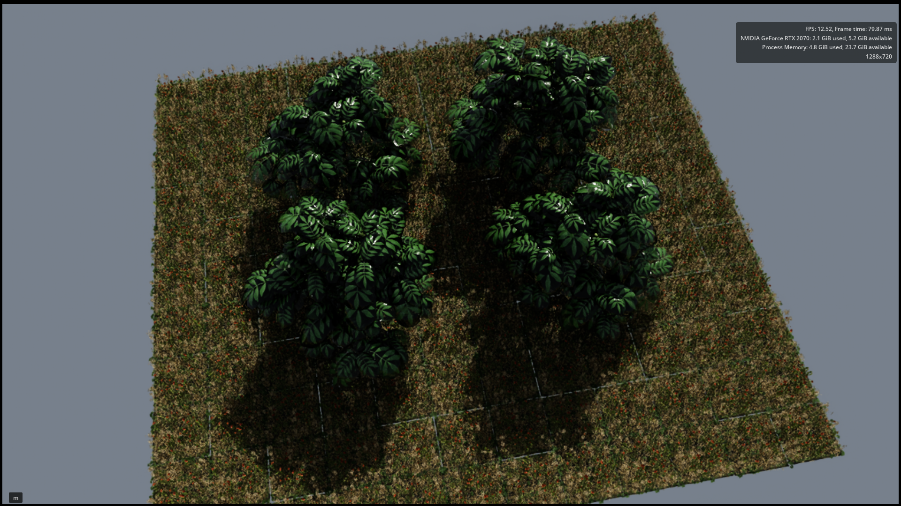
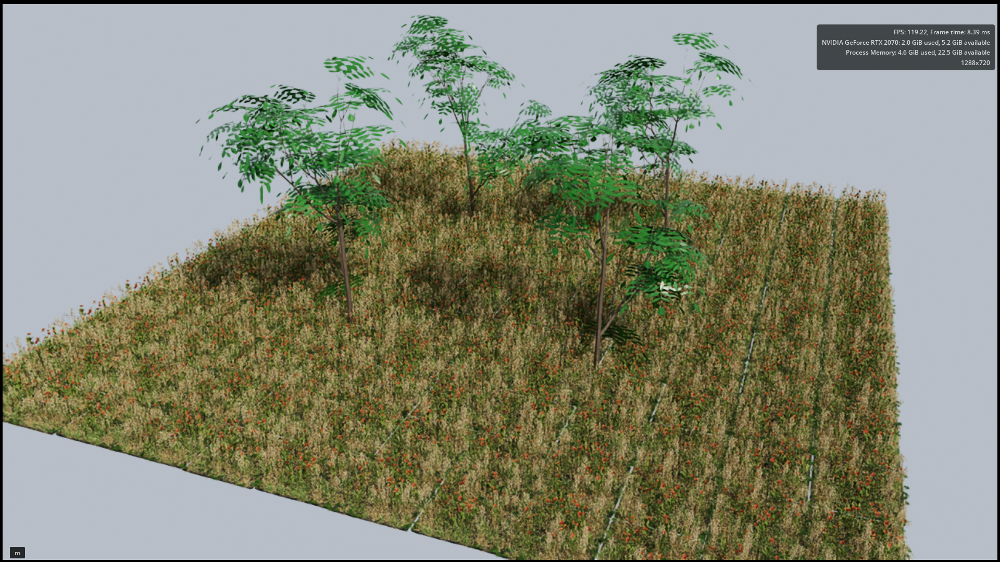

# Farm Generation

Code herein generates a configurable pecan orchard as a USD(A) (Pixar's Unified Scene Description) world for robotics simulation (via NVIDIA IsaacSim). The generated USD(A) uses asset references to existing tree and ground-cover assets rather than copying their geometry. Repeated vegetation references are
marked instanceable so renderers can share their large source geometry.

The orchard is Z-up and uses meters. Trees are arranged in rows, weeds are randomly arranged along tree rows, and a textured static collision ground plane spans the requested ground extent. A high-angle distant sun provides directional
lighting and shadows, while a dome light provides diffuse daytime sky fill.
Environment lights embedded in referenced assets are removed before use (see the assets section below).

## Install

This repo (specifically, `env.sh`) assumes the Nvidia USD python package is installed at `~/nv_usd`. There are other ways to install the USD python package. Use the provided environment setup so Python can find NVIDIA USD, then install the package in editable mode:

```bash
source env.sh
python -m pip install -e .
```

It can be helpful/faster to install via `python -m pip install -e . --no-deps --no-build-isolation` if you have the dependencies already installed.

The active Python environment must provide `pxr` (USD) and PyYAML.

This repo has been tested with USD version 25.08, using Python 3.12, and IsaacSim version 6.0.1.

## Usage

Generate the default orchard:

```bash
source env.sh
generate-orchard orchard_config.yaml orchard_world.usda
```

Generate an orchard using tree assets discovered from a directory:

```bash
source env.sh
generate-orchard \
  --tree-source assets/pecan_trees \
  --weed-source assets/weeds \
  --sky-texture-source assets/dome_texture_no_clouds.png \
  orchard_config.yaml \
  test_output/orchard_generated_trees_world.usda
```

The command accepts a YAML configuration file followed by the output filename. By default (this will change), it uses possibly licensed (see below) asssets in the `assets` directory. 
`--tree-source` may point to a single USD tree file or to a directory. Directory sources are searched
recursively for `.usd`, `.usda`, and `.usdc` files, excluding hidden directories
and common scratch directories such as `temp` and `tmp`. When multiple tree
assets are found, each tree placement randomly chooses one source asset while
remaining instanceable.
`--weed-source` may point to a single USD weed file or to a directory. See above for tree source.
`--sky-texture-source` may point to an image file used as a latlong dome light
texture for daytime sky illumination.

The supported parameters and authoritative defaults are defined by
[`OrchardConfig`](src/orchard_generator/config.py). `orchard_config.yaml`
provides an example configuration.

| Parameter          | Default | Description                                                                                                        |
|--------------------| ---: |--------------------------------------------------------------------------------------------------------------------|
| `n_rows`           | `2` | Number of tree rows. Rows are spaced along the X axis.                                                             |
| `n_cols`           | `2` | Number of trees in each row. Columns are spaced along the Y axis.                                                  |
| `tree_scaling_min` | `2.0` | Minimum uniform random scale applied to each tree.                                                                 |
| `tree_scaling_max` | `2.2` | Maximum uniform random scale applied to each tree.                                                                 |
| `weed_scaling_min` | `1.0` | Minimum uniform random scale applied to each weed.                                                                 |
| `weed_scaling_max` | `1.0` | Maximum uniform random scale applied to each weed.                                                                 |
| `ground_extent`    | `4.0` | Ground-cover and collision-plane extent, in meters, beyond the outermost tree positions.                           |
| `row_spacing`      | `5.0` | Distance between tree rows, in meters.                                                                             |
| `col_spacing`      | `4.0` | Distance between trees within each row, in meters.                                                                 |
| `sky_intensity`    | `500.0` | Intensity authored on the sky dome light.                                                                          |
| `random_seed`      | `null` | Optional random seed for repeatable scales and rotations. Omit it or use `null` for different transforms each run. |

Tree rotations are selected randomly about the Z axis. Ground-cover rotations
are selected randomly in 90-degree increments. Minimum scaling values must be
greater than zero, maximum scaling values must not be below their corresponding
minimums, and spacing values must be greater than zero.

The output stores references relative to its own location. Keep the
`assets` directory and its texture subdirectories available at those relative
paths when moving or packaging the generated output.

The ground-plane texture is generated by `tests/test_generate_ground.py` at
`assets/ground_plane.png`. The orchard ground mesh uses UVs that repeat this
texture every 4 meters and expands the mesh extents outward to complete 4 m
tiles.

## Tests

Run the functional test from the project root:

```bash
source env.sh
python -m unittest discover -s tests
```

## Assets

Some assets are not provided in this repository, due to licensing restrictions. 

### Assets from TurboSquid (not checked in)

The purchased assets used here were exported from Blender - after opening the Blender version of the asset. This involved various manipulations of the blender asset to make it generate USD palatable to ... USD consumers. Generally speaking, Blender assets have too much complex logic for USD - eliminating Ambient Occlusion and simplifying the usage of the alpha texture are needed. Also, Blender seems to be injecting a light source into each asset, which causes an epileptic fit in IsaacSim. These can be deleted in the asset USDA file, although presumably there is a setting in Blender to not do this.

The TurboSquid assets are:

[Poppy Meadow Patch and Free Gift 3D model](https://www.turbosquid.com/FullPreview/Index.cfm/ID/1646371)

[3D 2021 PBR Pecan Tree Collection - Carya Illinoensis](https://www.turbosquid.com/FullPreview/1804303)

### Generated Assets

As an alternative to purchased assets, Google Antigravity generated code for procedural generation of assets for pecan trees following the [L-system](https://en.wikipedia.org/wiki/L-system) rules for trees. See the `Interesting papers` section for an interesting alternative to the L-system approach. The initial prompt is given in `agy_instruction1.txt`. The generated assets are in `test_output/pecan_trees`, and are generated by code in `tests/test_generate_tree.py`, which uses `src/orchard_generator/tree_generator.py`.

It should be fairly straightforward to generate pecan trees of various ages using the procedural system implemented here. Other assets (weeds) should be straightforward to generate as well.

## Generation

An IsaacSim render of the default orchard with assets from TurboSquid is shown below. 



An IsaacSim render of a similar orchard with assets generated by `tests/test_generate_assets.py` suggests that one can procedurally generate usable assets:



Note I have only done a little tuning to the generated assets, so they are not as lush as the assets from TurboSquid. Also, orchard parameters have changed a bit relative to the previous render.

## AI assistance

ChatGPT 5.5 (OpenAI, 06/2026) and Codex (OpenAI, 06/2026) were used to assist in the creation of this repo and converting of assets to USD(A). As well, Gemini 1.5 Pro (Google, 06/2026) was used to assist in manipulation of the assets in Blender. See `codex_instruction1.txt` for the first set of instructions given to Codex to start code generation. Codex converged to pretty good results after a few iterations. It helps to know the right questions and doubts to have.

Additionally, Antigravity (powered by Google's Gemini 3.5 Flash model, 06/2026) was used to code for procedural generation of the young pecan tree assets, leaf and bark textures, L-system recursive branching logic, 3D curved leaf geometry, and USD material bindings. This code is in `tests/test_generate_tree.py` and `src/orchard_generator/tree_generator.py`.

## Interesting papers

1. Štava, O., Pirk, S., Kratt, J., Chen, B., Měch, R., Deussen, O., & Beneš, B. (2014). *Inverse Procedural Modelling of Trees*. Computer Graphics Forum, 33(6), 118–131. DOI: 10.1111/cgf.12282. [Link](https://onlinelibrary.wiley.com/doi/abs/10.1111/cgf.12282)
